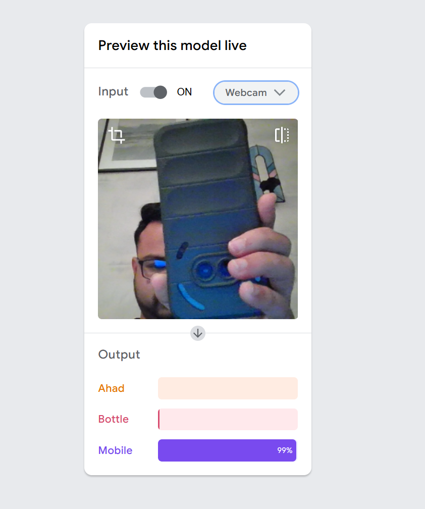

# AI Object Detector

A machine learning model trained to recognize specific objects using Google's Teachable Machine. 

## Live Model
[Teachable Machine Model - Try it here!](https://teachablemachine.withgoogle.com/models/bUhZAKwwW/)

## Visual Preview

## Overview
This project demonstrates the training of a custom image classification model. The model was trained in the browser to detect and distinguish between different objects. 

## Project Notes
Check out `project_notes.md` for answers to the critical thinking questions regarding Supervised Learning and Edge Cases.
